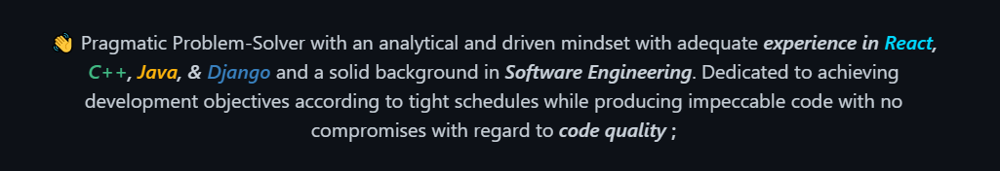

<!-- markdownlint-disable -->
<link rel="preconnect" href="https://fonts.googleapis.com">
<link rel="preconnect" href="https://fonts.gstatic.com" crossorigin>
<link href="https://fonts.googleapis.com/css2?family=Changa:wght@200;300;400;500;600;700;800&display=swap" rel="stylesheet">

<h1 style="font-family: 'Changa', sans-serif; font-size: 40px; font-weight: 500;"><a href="https://ramoun.me">Ramoun</a></h1>

    

## 💻 Tech Stack

<!-- START OF PROFILE STACK, DO NOT REMOVE -->
<table align="center">
<thead>
<tr>
<th>💻 <strong>Technology</strong></th>
<th>🚀 <strong>Projects</strong></th>
</tr>
</thead>
<tbody>
<tr>
<td></td>
<td></td>
</tr>
<tr>
<td></td>
<td></td>
</tr>
<tr>
<td></td>
<td>      </td>
</tr>
</tbody>
</table>

## ✨ Stats

## Interests

- Interested in C++ & Python. Recent focus on full stack.
- Currently learning Microprocessor Design & Programming.
- Reading more about Computer History, History of C, Dennis Ritchie.
- With 8+ years of computer science and technology education and 6 months of development working experience.
- Encouraging people for open source collaborations.

---

<b>Visitor's Count</b>

---
